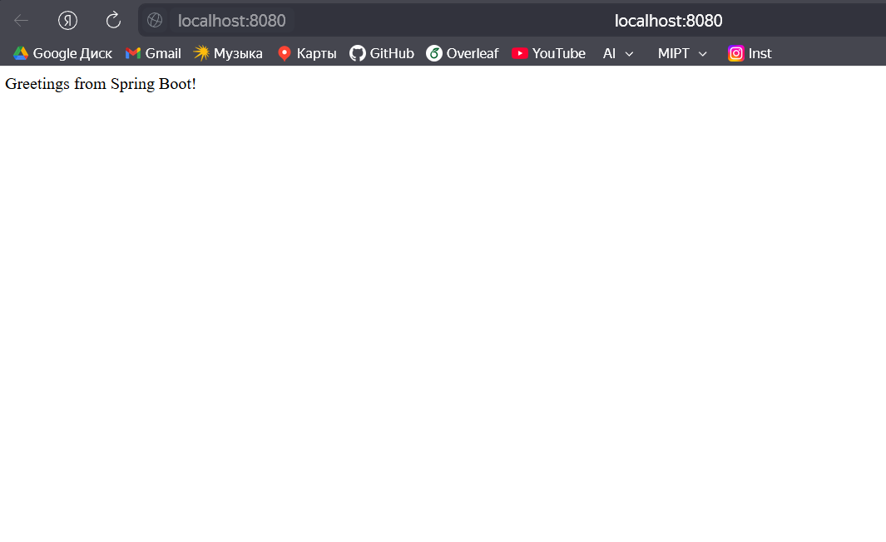

# Lab 3. Docker multistage

---
Start docker container for build and deployment:

```bash
    docker-compose up -d
```

In console, we will see the following:

```
  .   ____          _            __ _ _
 /\\ / ___'_ __ _ _(_)_ __  __ _ \ \ \ \
( ( )\___ | '_ | '_| | '_ \/ _` | \ \ \ \
 \\/  ___)| |_)| | | | | || (_| |  ) ) ) )
  '  |____| .__|_| |_|_| |_\__, | / / / /
 =========|_|==============|___/=/_/_/_/

 :: Spring Boot ::                (v3.3.5)

2025-02-24T19:58:32.216Z  INFO 1 --- [spring-boot] [           main] com.example.springboot.Application       : Starting Application v0.0.1-SNAPSHOT using Java 17.0.14 with PID 1 (/app.jar started by root in /)
2025-02-24T19:58:32.221Z  INFO 1 --- [spring-boot] [           main] com.example.springboot.Application       : No active profile set, falling back to 1 default profile: "default"
2025-02-24T19:58:33.549Z  INFO 1 --- [spring-boot] [           main] o.s.b.w.embedded.tomcat.TomcatWebServer  : Tomcat initialized with port 8080 (http)
2025-02-24T19:58:33.567Z  INFO 1 --- [spring-boot] [           main] o.apache.catalina.core.StandardService   : Starting service [Tomcat]
2025-02-24T19:58:33.567Z  INFO 1 --- [spring-boot] [           main] o.apache.catalina.core.StandardEngine    : Starting Servlet engine: [Apache Tomcat/10.1.31]
2025-02-24T19:58:33.621Z  INFO 1 --- [spring-boot] [           main] o.a.c.c.C.[Tomcat].[localhost].[/]       : Initializing Spring embedded WebApplicationContext
2025-02-24T19:58:33.624Z  INFO 1 --- [spring-boot] [           main] w.s.c.ServletWebServerApplicationContext : Root WebApplicationContext: initialization completed in 1317 ms
2025-02-24T19:58:34.125Z  INFO 1 --- [spring-boot] [           main] o.s.b.w.embedded.tomcat.TomcatWebServer  : Tomcat started on port 8080 (http) with context path '/'
2025-02-24T19:58:34.147Z  INFO 1 --- [spring-boot] [           main] com.example.springboot.Application       : Started Application in 2.503 seconds (process running for 3.143)
```

Also, if we go to `localhost:8080`, we will see a message from spring:

