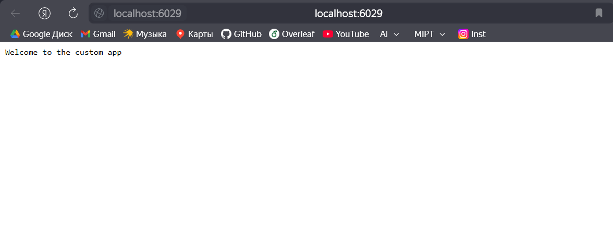

# Lab 4. Multistage docker build with different dependency levels

---

1. Level 1 - installing all dependencies in `alpine-go-1.23.2`:
```
docker build -t "alpine-go-1.23.2" -f ./docker/Dockerfile.system .
```
To verify that everything works as planned on this stage we can run
```
docker run -it -d --name lab4-docker-dependency-levels-build alpine-go-1.23.2 sh
```
And inside the container check `go version`:
```
/ # go version
go version go1.23.2 linux/amd64
```

2. Level 2 - building app in `go-app-build`:
```
docker build -t "go-app-build" -f ./docker/Dockerfile.build .
```

3. Level 3 - running application in `go-app`:
```
docker build -t "go-app" -f ./docker/Dockerfile.run .
```

4. Now that we have made all images, we can proceed with starting the app:
```
docker-compose up -d
```
If we visit `localhost:6029` now, we will see the working app:
